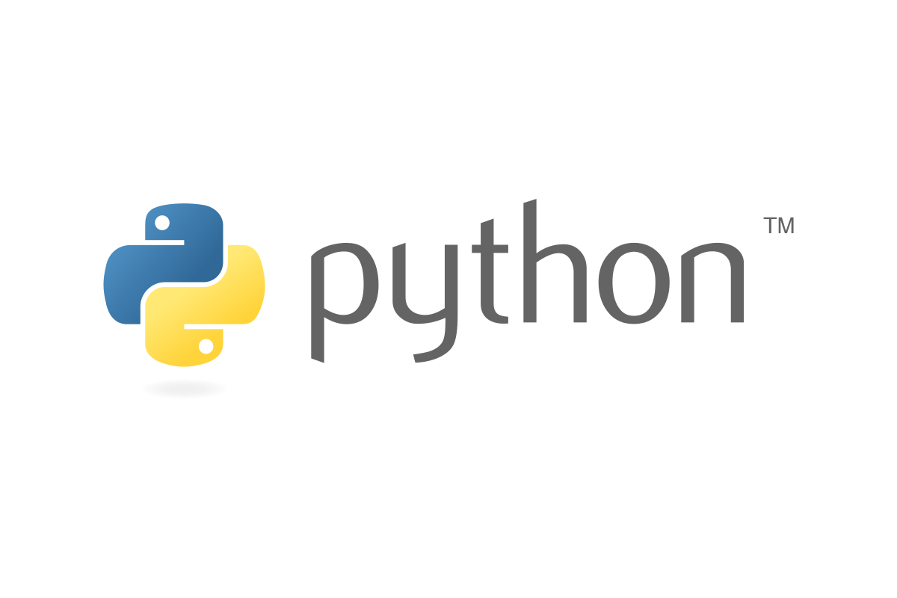

# Computer Science Fundamentals

## Description
A comprehensive collection of Python laboratory assignments developed for the **Informatica** course during my Bachelor's Degree in Computer Engineering at **Politecnico di Torino**. The repository showcases foundational computer science competencies, focusing on algorithmic thinking, clean procedural programming, core data structure design, and robust file I/O data processing.

---

## Core Competencies & Topics Covered

* **Algorithmic Logic & Control Flow:** Conditional branching, complex iterative routines, and edge-case handling.
* **Data Structures:** Hands-on manipulation of native Python collections, including lists, tuples, sets, and dictionaries.
* **Modular Software Design:** Function decomposition, scope scoping rules, and recursive problem-solving.
* **File I/O & Text Processing:** Parsing, cleaning, and extracting structured information from raw text and CSV files.
* **Matrix Operations:** Multi-dimensional arrays and coordinate-based grid simulations.

---

## Technologies & Tools

* **Language:** Python 3.x
* **Standard Libraries:** `sys`, `math`, `csv`, `string`, `random`
* **Development Tools:** VS Code

---
